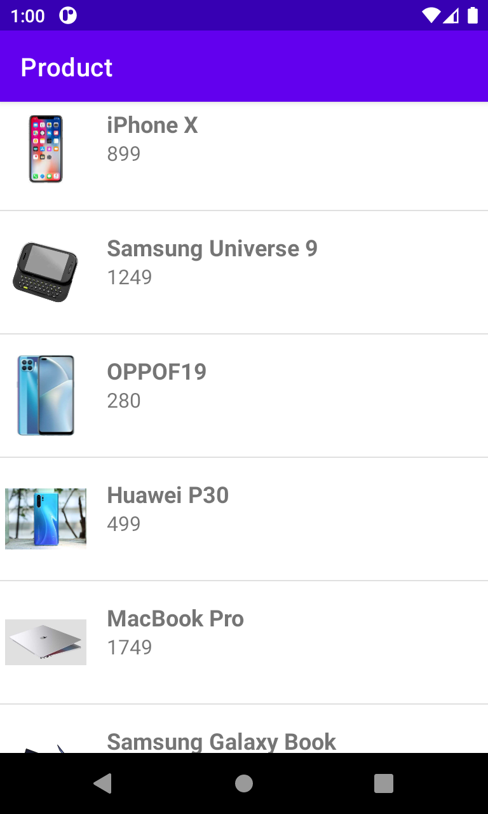
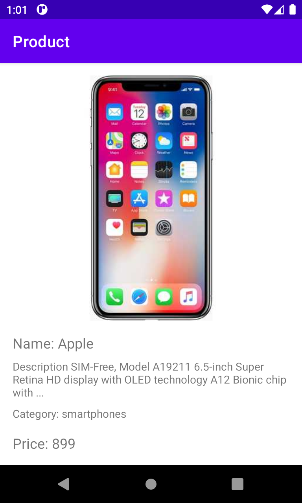
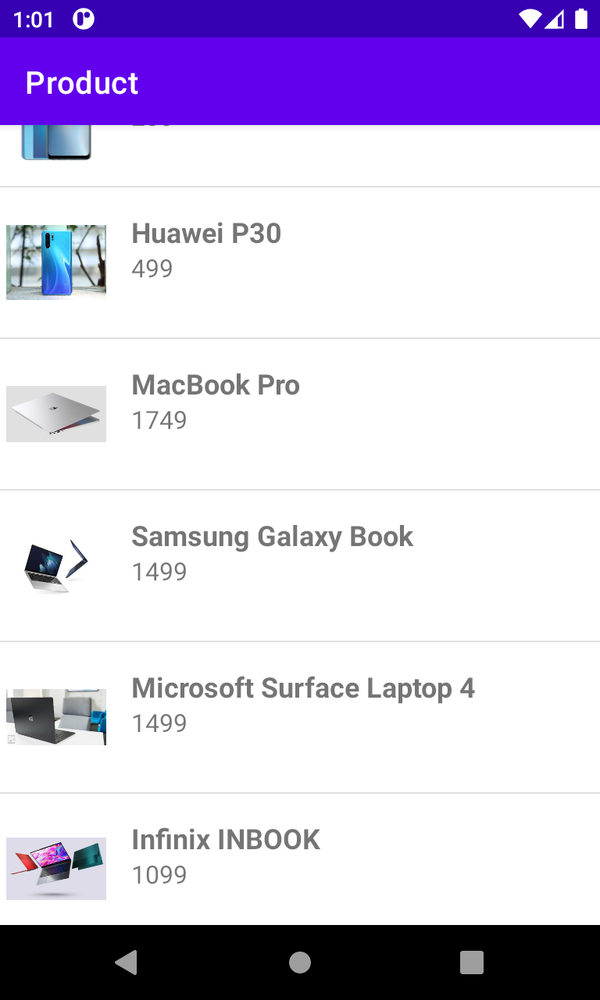
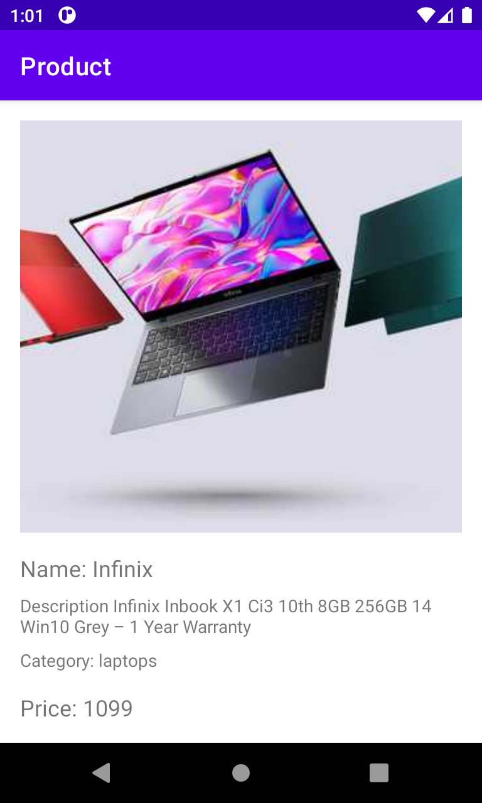

# Get Product Application
This repository demonstrates an application that retrieves product data from an API and provides detailed information about each product. The application is built using a programming language such as Kotlin and utilizes APIs or services to fetch product data.

The main functionality of the application revolves around making API requests to retrieve a list of products. It may employ techniques like pagination to handle large amounts of data effectively. Once the product list is obtained, the application displays the products in a user-friendly interface.

# Demo
   
